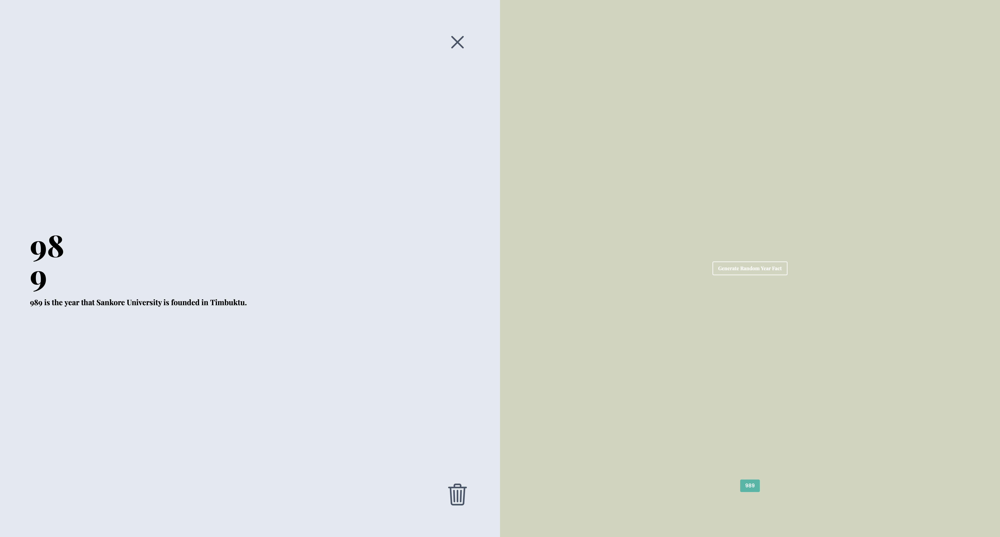
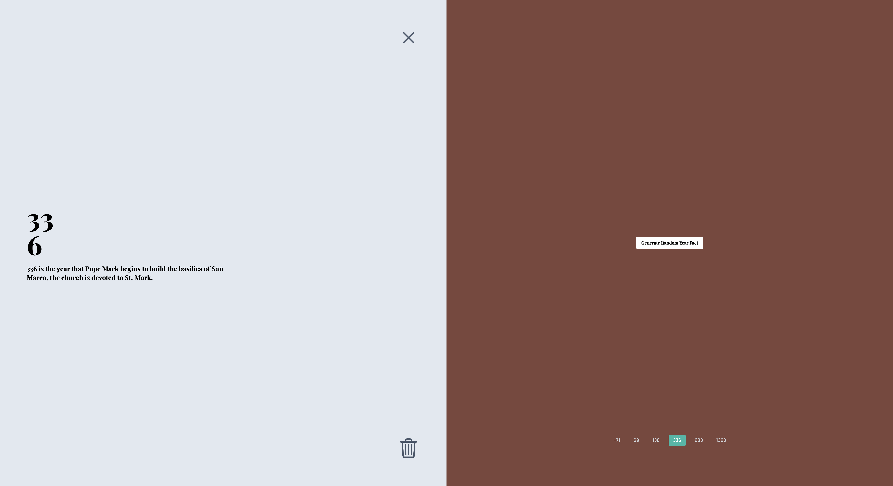

<h1 align="center"><strong>METYIS</strong> - Interview Project</h1>

  	
  	
  	
	
	

 

<h2>Project</h2>

Build a SPA that follows these requirements:

-   Ability to generate random facts. You can use this endpoint from NumbersAPI: http://numbersapi.com/random/year?json
-   Display the facts in a timeline by year
-   Show more info about a year’s fact by clicking on that year in the timeline.
-   Ability to remove uninteresting facts.

 

<h2>Goal</h2>

You can choose to implement the design given or change it to something more of your liking. Attention to detail and usability concerns are appreciated.

**First Screen with no facts:**

**Screen with 1 fact generated:**

**Screen with 2 facts generated:**

**Change between facts:**

 

<h2>Final Result</h2>

**Homepage without facts:**

**One random fact:**

**Multiple Facts:**

<h3>Improvements & Details</h3>

-   I use a free API to get a random color to show it on the right side of the screen;
    -   [Colr.org](https://www.colr.org/json/colors/random/) - Example.
-   I use **TailwindCSS** as a **CSS** Framework;
-   I use **React Router DOM** and create 2 pages:
    -   **Home:** the initial page without facts;
    -   **Facts:** the page with the facts generated by user.
-   Create the button as a component (**OutlineButton**) with props like:
    -   `color`: with dark or light as a possible values;
    -   `to`: the path if I want use the button as a link (from **React Router Dom**);
    -   `onClick`: if you want use the component as a button.

<h3>To Do</h3>

-   [x] ~Use `react-hot-tost` to improve the feedback on some actions~
-   [x] ~Generate a new color when generate a new fact~
-   [x] ~Hide delete button when you don't have any facts~
-   [ ] Persist the generated facts (using like `localStorage` or `sessionStorage`)
-   [x] ~Make the layout responsive~
-   [ ] I can't implement the timeline, instead I generate a list of years on the bottom of the right side of the screen;
    -   The main goal is you change between facts clicking on the year.

 

<h3 style="font-weight: 300">
🧑🏻‍💻 About Me
</h3>

<a href="https://github.com/TutoDS" alt="TutoDS">

 
 <b>Daniel Sousa @TutoDS</b>
</a>

 

